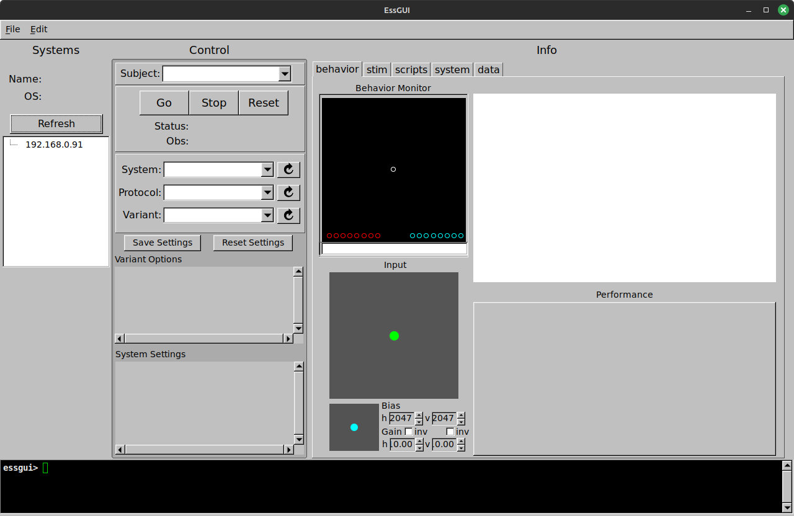

# Local setup for working with systems.

Here are instructions for getting started with [dserv](https://github.com/SheinbergLab/dserv), [stim2](https://github.com/SheinbergLab/stim2), and the [dlsh](https://github.com/SheinbergLab/dlsh) tcl packages.
With these you should be able to run/test/demo [ess](https://github.com/SheinbergLab/ess) state systems like emcalib, match_to_sample, and planko.

These instructions are for setting up a local environment on each of three target platforms:
 - arm64 macOS (version 14 Sonoma or later)
 - amd64 Linux Debian (including Ubuntu, etc)
 - arm64 Linux Debian (including [Raspberry Pi OS](https://www.raspberrypi.com/software/))

# Install packages from CI

This section explains what to install for each platform.
The Following sections, [Startup](#startup) and [Running systems](#running-systems), explain how to run/test/demo state systems.

## macOS arm64

For macOS we'll imagine a personal workstation or laptop and install things interactively with browser, Finder, and terminal. 

### homebrew packages

We have some homebrew package dependencies.  You might need to [install homebrew](https://brew.sh/).

Then from a terminal:

```
brew install tcl-tk@9 yajl
```

### dserv and essgui

The [latest dserv and essgui releases](https://github.com/benjamin-heasly/dserv/releases) can be found on GitHub.  These instructions use verison `0.0.53`

Download [dserv-0.0.53-Darwin-signed.pkg](https://github.com/benjamin-heasly/dserv/releases/download/0.0.53/dserv-0.0.53-Darwin-signed.pkg), double-click the downloaded `.pkg` file, and follow installer prompts.

Download [essgui-0.0.53-Darwin.dmg](https://github.com/benjamin-heasly/dserv/releases/download/0.0.53/essgui-0.0.53-Darwin.dmg), double-click the downloaded `.dmg`, and drag the `essgui` app to the `Applications` folder.


### stim2

The [latest stim2 release](https://github.com/benjamin-heasly/stim2/releases) can be found on GitHub.  These instructions use version `0.0.35`.

Download [stim2-0.0.35-Darwin.dmg](https://github.com/benjamin-heasly/stim2/releases/download/0.0.35/stim2-0.0.35-Darwin.dmg), double-click the downloaded `.dmg`, and drag the `stim2` app to the `Applications` folder.

### dlsh

The [latest dlsh release](https://github.com/benjamin-heasly/dlsh/releases) can be found on GitHub.  These instructions use version `0.0.48`.

Download [dlsh-0.0.48-Darwin-arm64.zip](https://github.com/benjamin-heasly/dlsh/releases/download/0.0.48/dlsh-0.0.48-Darwin-arm64.zip).  Then from a terminal:

```
sudo mkdir -p /usr/local/dlsh/
sudo cp ~/Downloads/dlsh-0.0.48-Darwin-arm64.zip /usr/local/dlsh/dlsh.zip
```

### ess

[ess](https://github.com/SheinbergLab/ess) is a Git repo that with system definitions.  To clone the latest to your HOME directory:

```
cd ~
git clone https://github.com/SheinbergLab/ess.git
```

Run the following from a terminal to configure dserv so that it can find `ess/` within your HOME directory:

```
echo "set env(ESS_SYSTEM_PATH) $HOME" > /usr/local/dserv/local/pre-systemdir.tcl
```

## Linux amd64 (laptop or workstation)

For Linux amd64 we'll imagine a personal laptop or workstation and install using a combination of the browser, terminal, and package manager. 

### system packages

We have several system package dependencies.  You should be able to install these via `apt` in a terminal:

```
sudo apt update
sudo apt install -y git ca-certificates build-essential
sudo apt install -y libevdev-dev zlib1g-dev
sudo apt install -y libpango1.0-dev libwayland-dev wayland-protocols libxkbcommon-dev libxinerama-dev libdbus-1-dev libglew-dev  libdecor-0-dev libgtk-3-dev liblz4-dev
```

### tcl 9

We depend on tcl version 9, which may not be available via system packages (yet).
It should be straightfowrad to get, build, and install.

```
git clone --branch core-9-0-1-rc https://github.com/tcltk/tcl.git
cd tcl/unix/
./configure
make
sudo make install
```

### dserv and essgui

The [latest dserv and essgui releases](https://github.com/benjamin-heasly/dserv/releases) can be found on GitHub.  These instructions use version `0.0.53`.

Download [dserv_0.0.53_amd64.deb](https://github.com/benjamin-heasly/dserv/releases/download/0.0.53/dserv_0.0.53_amd64.deb), then double-click the downloaded `.deb` file and follow installer prompts.

Download [essgui_0.0.53_amd64.deb](https://github.com/benjamin-heasly/dserv/releases/download/0.0.53/essgui_0.0.53_amd64.deb), then double-click the downloaded `.deb` file and follow installer prompts.


### stim2

The [latest stim2 release](https://github.com/benjamin-heasly/stim2/releases) can be found on GitHub.  These instructions use version `0.0.35`.

Download [stim2_0.0.35_amd64.deb](https://github.com/benjamin-heasly/stim2/releases/download/0.0.35/stim2_0.0.35_amd64.deb), then double-click the downloaded `.deb` file and follow installer prompts.

### dlsh

The [latest dlsh release](https://github.com/benjamin-heasly/dlsh/releases) can be found on GitHub.  These instructions use version `0.0.48`.

Download [dlsh-0.0.48-Linux-amd64.zip](https://github.com/benjamin-heasly/dlsh/releases/download/0.0.48/dlsh-0.0.48-Linux-amd64.zip).  Then from a terminal:

```
sudo mkdir -p /usr/local/dlsh/
sudo cp ~/Downloads/dlsh-0.0.48-Linux-amd64.zip /usr/local/dlsh/dlsh.zip
```

### ess

[ess](https://github.com/SheinbergLab/ess) is a Git repo that with system definitions.  To clone the latest to your HOME directory:

```
cd ~
git clone https://github.com/SheinbergLab/ess.git
```

Run the following from a terminal to configure dserv so that it can find `ess/` within your HOME directory:

```
echo "set env(ESS_SYSTEM_PATH) $HOME" | sudo tee /usr/local/dserv/local/pre-systemdir.tcl
```

## Linux arm64 (Raspberry Pi)

For Linux arm64 we'll imagine a [Raspberry Pi](https://www.raspberrypi.com/) and install things via a terminal and package manager.
Steps like these should work from noninteractive scripts.

### system packages

We have several system package dependencies.  You should be able to install these via `apt`

```
sudo apt update
sudo apt install -y git ca-certificates build-essential wget
sudo apt install -y libevdev-dev zlib1g-dev
sudo apt install -y libpango1.0-dev libwayland-dev wayland-protocols libxkbcommon-dev libxinerama-dev libdbus-1-dev libglew-dev  libdecor-0-dev libgtk-3-dev liblz4-dev
```

### tcl 9

We depend on tcl version 9, which may not be available via system packages (yet).
It should be straightfowrad to get, build, and install.

```
git clone --branch core-9-0-1-rc https://github.com/tcltk/tcl.git
cd tcl/unix/
./configure
make
sudo make install
```

### dserv and essgui

The [latest dserv and essgui releases](https://github.com/benjamin-heasly/dserv/releases) can be found on GitHub.  These instructions use version `0.0.53`.

To install dserv and essgui:

```
wget https://github.com/benjamin-heasly/dserv/releases/download/0.0.53/dserv_0.0.53_arm64.deb
sudo apt install --yes ./dserv_0.0.53_arm64.deb

wget https://github.com/benjamin-heasly/dserv/releases/download/0.0.53/essgui_0.0.53_arm64.deb
sudo apt install --yes ./essgui_0.0.53_arm64.deb
```

### stim2

The [latest stim2 release](https://github.com/benjamin-heasly/stim2/releases) can be found on GitHub.  These instructions use version `0.0.35`.

To install stim2:

```
wget https://github.com/benjamin-heasly/stim2/releases/download/0.0.35/stim2_0.0.35_arm64.deb
sudo apt install --yes ./stim2_0.0.35_arm64.deb
```

Set up default IO pin configuration for stim2 to use:

```
sudo mv /usr/local/dserv/local/post-pins.tcl.EXAMPLE /usr/local/dserv/local/post-pins.tcl
```

### dlsh

The [latest dlsh release](https://github.com/benjamin-heasly/dlsh/releases) can be found on GitHub.   These instructions use version `0.0.48`.

To install dlsh.zip:

```
wget https://github.com/benjamin-heasly/dlsh/releases/download/0.0.48/dlsh-0.0.48-Linux-arm64.zip
sudo mkdir -p /usr/local/dlsh/
sudo cp ~/Downloads/dlsh-0.0.48-Linux-arm64.zip /usr/local/dlsh/dlsh.zip
```

### ess

[ess](https://github.com/SheinbergLab/ess) is a Git repo that with system definitions.  To clone the latest to your HOME directory and configure dserv so it knows the location:

```
cd ~
git clone https://github.com/SheinbergLab/ess.git
echo "set env(ESS_SYSTEM_PATH) $HOME" > /usr/local/dserv/local/pre-systemdir.tcl
```

# Startup

With dependencies and programs installed for your platform, you can now start dserv, stim2, and essgui.
The last section below, [Running systems](#running-systems), explains how to select specific state systems and interact with them via essgui and stim2.

## macOS

For macOS we'll imagine you're testing systems interactively during development.

### dserv

You can start dserv running in a terminal.

```
/usr/local/dserv/dserv -c /usr/local/dserv/config/dsconf.tcl -t /usr/local/dserv/config/triggers.tcl
```
This should print out a few messages, then wait for more to happen.

### stim2

From Launchpad or Finder, you can start the stim2 app.
This should bring up a blank (black) graphics window.

### essgui

From Launchpad or Finder, you can start the esssgui app.
See below for examples of running state systems via essgui.

## Linux

For Linux the following startup steps should work with amd64 or arm64 -- laptop, workstation, or Raspberry Pi. 

### dserv

On Linux we can run dserv as a system service (aka background process or daemon) via [systemd](https://en.wikipedia.org/wiki/Systemd).
The dserv install above should have created a script for installing the system service.
Run this script from a terminal:

```
sudo install-dserv-service.sh
```

You can start, stop, and monitor the dserv service:

```
sudo systemctl stop dserv
sudo systemctl start dserv
sudo systemctl status dserv
```

### stim2

You can start stim2 from a terminal and let the process run in the background:

```
stim2 -f /usr/local/stim2/config/linux.cfg &
```
This should bring up a blank (black) graphics window.

### essgui

You can start essgui from a terminal.

```
essgui
```
See below for examples of running state systems via essgui.

# Running systems

With dserv, stim2, and essgui running, you can play through specific state systems.

The images below are from a Linux laptop but the same instructions should work from any platform.

## initial state

When stim2 first starts up, it should show a blank (black) window like this:


When essgui first starts up, it should look similar to this:



## select the planko system

In essgui, select your local dserv instance by IP address, and select the planko system.

 - Under **Systems**, select your local IP address, in this example `192.168.0.91`.
 - Under **Control** and **System:** select `planko`.
 - Under **Control** press `Go`.

The planko system should now show as running:


## play planko

In the stim2 window, you should see several objects like this:


The U-shaped "bucket" objects at the bottom should be interactive via the mouse.
Click which bucket you think the ball at the top would fall into, when it drops.
Watch the physics simulation play out and see if you guessed right:


Or if you guessed wrong:


