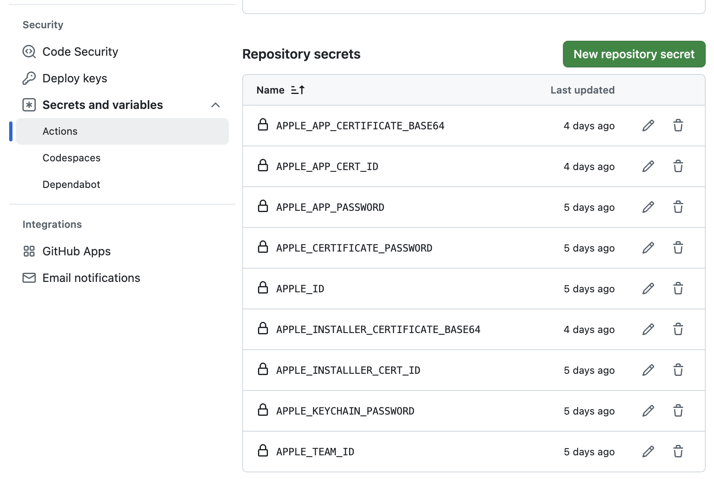

# GitHub Actions setup for macOS

This page documents GitHub repository setup that enables us to build and release dserv for macOS.
This includes:

 - code signing
 - packaging as as a macOS .pkg installer
 - [Apple notarization](https://developer.apple.com/documentation/security/notarizing-macos-software-before-distribution)
 - adding a macOS .pkg artifact to repository [releases](https://github.com/SheinbergLab/dserv/releases)

## Overview

The config for building, notarizing, and releasing on macOS lives here in this repo at [.github/workflows/release_macos.yml](.github/workflows/release_macos.yml).

The build process needs to create a temporary macOS [keychain](https://support.apple.com/guide/keychain-access/what-is-keychain-access-kyca1083/mac) and install Apple developer certificates that it will use use for code signing.

The notarization process requires authentication as your developer account.

Both of these steps require access to secrets associated with your [Apple developer](https://developer.apple.com/) account.
The config YAML refers to secrets using syntax like `${{ secrets.APPLE_ID }}`.
These secrets must be configured ahead of time, as described below.

## GitHub secrets config

The macOS build and release relies on a number of secrets values, stored securely as [repository secrets](https://docs.github.com/en/actions/security-for-github-actions/security-guides/using-secrets-in-github-actions#creating-secrets-for-a-repository).



Each secret can be created by navigating to:

 - repository `Settings`
 - `Secrets and variables`
 - `Actions`
 - `New repository secret`

The names of the secrets, eg `APPLE_ID`, should match the names referenced in the workflow YAML, eg `${{ secrets.APPLE_ID }}`.

The values of the secrets will depend on your own Apple developer account.
Each of these is described below.

### `APPLE_ID`

The value for `APPLE_ID` sholuld be the usual ID for your [Apple developer](https://developer.apple.com/) account.
It might be the email address you used when you registered.

### `APPLE_TEAM_ID`

Your `APPLE_TEAM_ID` should be displayed in the `Membership details` section of your developer [Account](https://developer.apple.com/account) page.
This might be a string of 10 alphanumeric characters.

### `APPLE_APP_PASSWORD`

Submitting artifacts for notarization requires your Apple account password.
**You should not use your main account password!**
Instead you should create a separate, app-specific password for GitHub to use.
App-specific passwords are better because you can revoke them whenever you need to, without messing up your overall account.

Here's how ([Apple docs](https://support.apple.com/en-us/102654)):

 - Sign in to your [Apple Account](https://account.apple.com/) (not the developer portal).
 - `Sign-In and Security`
 - `App-Specific Passwords`
 - `+`

Your new `APPLE_APP_PASSWORD` might be a string of 16 letters plus hypens making groups of 4.

### `APPLE_CERTIFICATE_PASSWORD` and `APPLE_KEYCHAIN_PASSWORD`

You'll need to create two certificates from your developer account and export them to a format that can be stored as a secret and imported during the build into a temporary macOS [keychain](https://support.apple.com/guide/keychain-access/what-is-keychain-access-kyca1083/mac).

But first -- pick two new, strong passwords.  These will protect the exported certificates and the temporary keychain.  One way to generate strong passwords is with a tool like [passwordsgenerator.net](https://passwordsgenerator.net/).

For `APPLE_KEYCHAIN_PASSWORD`: you can add this as a GitHub secret, then forget it.

For `APPLE_CERTIFICATE_PASSWORD`: add this as a GitHub secret, use it  when exporting certificates below, then forget it.

### `APPLE_APP_CERTIFICATE_BASE64`

The build requires a certificate to use for singing executables like `dserv`.
This will be a `Developer ID Application` certificate.

To make one:

 - Locally on your development mac, [Create a certificate signing request](https://developer.apple.com/help/account/certificates/create-a-certificate-signing-request) and save to disk.
 - Sign in to your [Developer Account](https://developer.apple.com/account).
 - Under "Certificates, IDs & Profiles" choose `Certificates`.
 - `+`
 - Choose `Developer ID Application`.
 - `Continue`
 - `Choose file` and select your certificate signing request from disk.
 - `Download`
 - Double-click the downloaded `developerID_application.cer` to automatically import it into your Keychain.

Now that you've created and imported your `Developer ID Application` certificate you could use it for code signing on your local development mac.
To enable code signing on GitHub Actions you must export the certificate from your keychain to a `p12` file.

Locally, from the Launchpad, open Keychain Access.
 - Choose the `Certificates` tab.
 - Search for "developer id application".
 - Select your `Developer ID Application` certificate and expand with `>`.
 - Right-click the private key that is revealed within.
 - Choose `Export`.
 - Save as `developer_id_application.p12`.
 - When prompted enter the `APPLE_CERTIFICATE_PASSWORD` that you generated above.  This will protect the exported `.p12` file.
 - Then, when prompted, enter your local login credentials.  This will confirm access to your own, local keychain.

Now you have a password-protected `.p12` file with details from your `Developer ID Application` certificate.  This is a binary file.  The last step is to [base64-encode](https://en.wikipedia.org/wiki/Base64) the binary contents as a string that you can save as a GitHub secret.

To encode the certificate and save the resulting text in your clipboard:

```
base64 -i developer_id_application.p12 | pbcopy
```

Finally, you can paste this chunk of text as the value of your `APPLE_APP_CERTIFICATE_BASE64` repository secret.

### `APPLE_APP_CERT_ID`

During the build, your "Developer ID Application" certificate will be imported into a temporary keychain.  The build will refer to this certificate by its ID.

To see the IDs of installed certificates:

```
security find-identity -p basic -v
```

Find the printed line for your "Developer ID Application" certificate and copy its ID.  This might be a string of 40 alphanumeric characters.  This is the value to store for your `APPLE_APP_CERT_ID` secret.

### `APPLE_INSTALLER_CERTIFICATE_BASE64` and `APPLE_INSTALLLER_CERT_ID`

The build also requires a certificate to use for singing installable .pkg archives like `dserv-1.3-Darwin-signed.pkg`.
This will be a `Developer ID Installer` certificate.

The process for your `APPLE_INSTALLER_CERTIFICATE_BASE64` and `APPLE_INSTALLLER_CERT_ID` is almost identical to what you just did for `APPLE_APP_CERTIFICATE_BASE64` and `APPLE_APP_CERT_ID`.

You can follow those same steps again, with minor changes:

 - You can reuse the same certificate signing request.
 - From your developer account, within "Certificates, IDs & Profiles", choose `Developer ID Installer`.
 - Double-click the downloaded `developerID_installer.cer` to automatically import it into your Keychain.
 - When exporting search for "developer id installer" and export `developer_id_application.p12`.
 - You can use the same `APPLE_CERTIFICATE_PASSWORD` to protect the `.p12`.

To encode the certificate and save the resulting text in your clipboard:

```
base64 -i developer_id_installer.p12 | pbcopy
```

Paste this chunk of text as the value of your `APPLE_INSTALLER_CERTIFICATE_BASE64` repository secret.

To see the IDs of installed certificates:

```
security find-identity -p basic -v
```

Find the printed line for your "Developer ID Installer" certificate and copy its ID.  This might be a string of 40 alphanumeric characters.  This is the value to store for your `APPLE_INSTALLLER_CERT_ID` secret.
