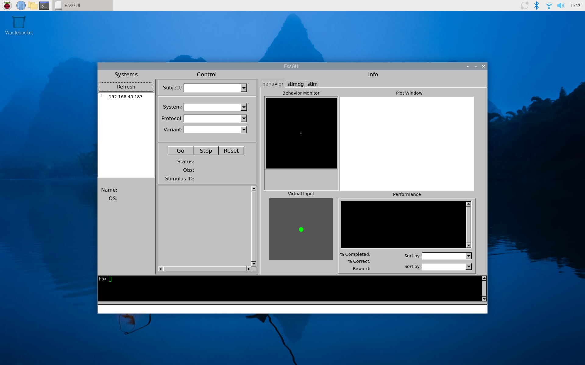
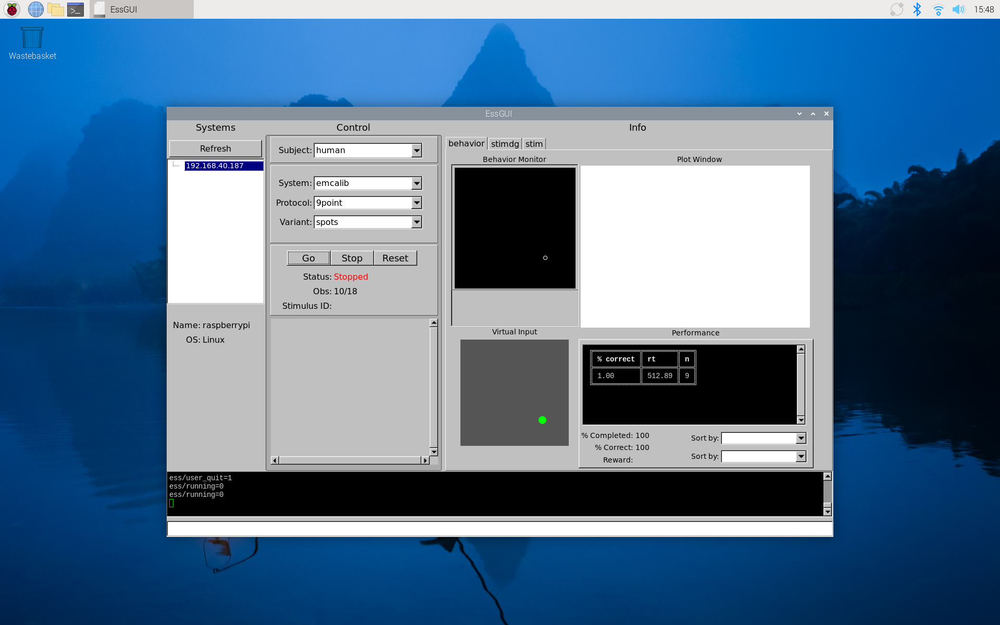
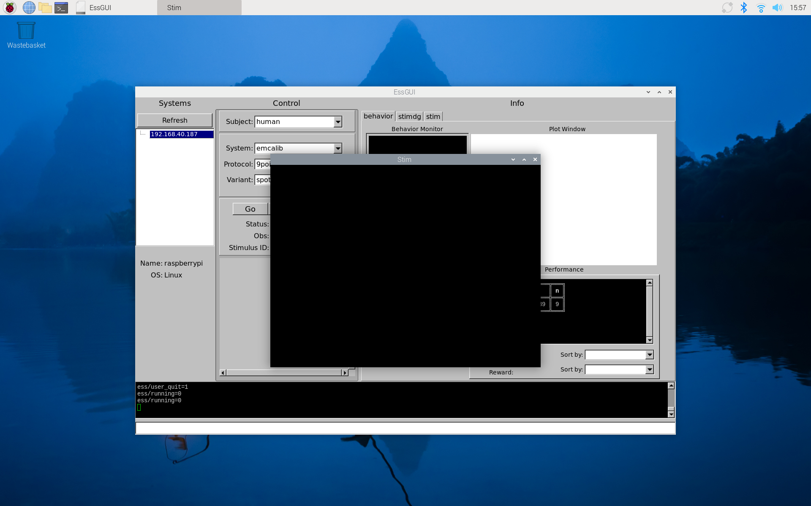
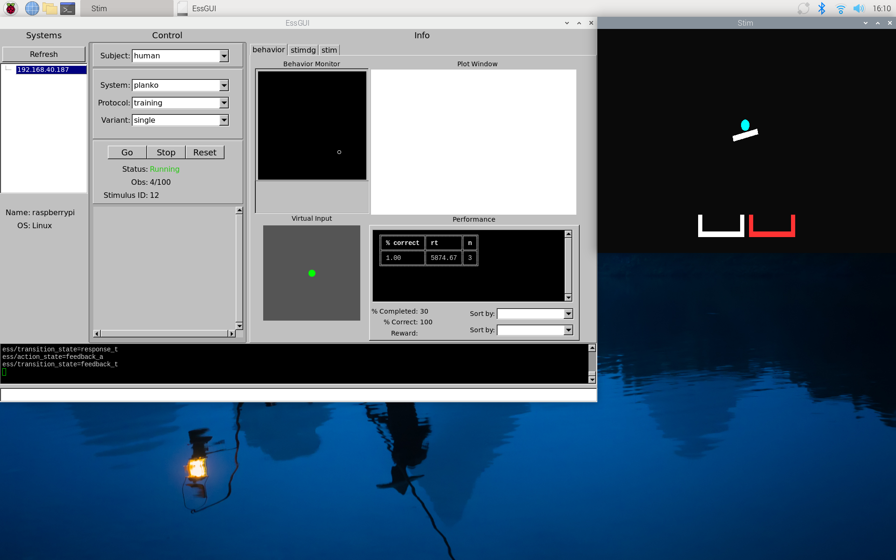
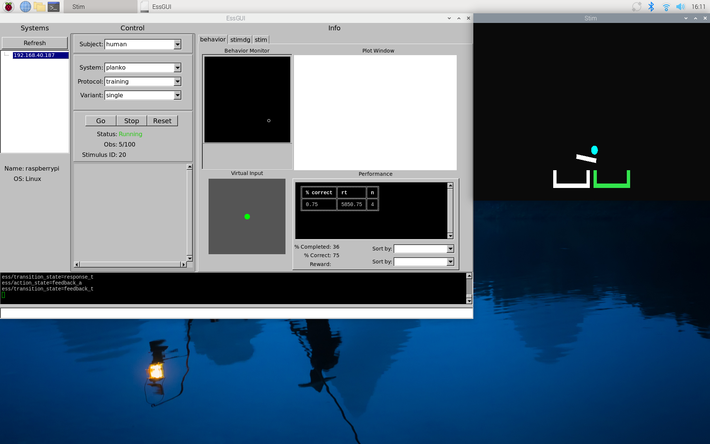

# Building and Installing `dserv`

This guide steps through building and installing `dserv` on a Raspberry Pi.
If you haven't already you can start by [setting up your Pi](./pi_setup.md) with real-time capabilities.

We'll run all of the steps below on the Pi itself, with a display attached.

## Setup for building

`dserv` builds with [cmake](https://cmake.org/cmake/help/latest/guide/tutorial/index.html).
Install `cmake` and ther build tools:

```
sudo apt install build-essential cmake
```

Install `dserv` dependencies for [General-Purpose IO](https://packages.debian.org/sid/libgpiod-dev) and [low-level event handling](https://packages.debian.org/buster/libevdev-dev):

```
sudo apt install libgpiod-dev libevdev-dev
```

To make commands concrete, this guide assumes we're workign in directory `~/code/`.

```
mkdir ~/code
```

## Build and install Tcl

`dserv` embeds [Tcl](https://github.com/tcltk/tcl), a dynamic programming language and runtime environment.
We can build and install Tcl from source:

```
cd ~/code/
git clone https://github.com/tcltk/tcl.git
cd tcl/unix/
./configure 
make
sudo make install
sudo ldconfig
```

You can test Tcl with a "Hello World" demo.

```
$ tclsh9.0
% puts "Hello World"
Hello World
% exit
```

## Build and install Jansson

`dserv` uses [Jansson](https://github.com/akheron/jansson.git) for JSON support.
We can build and install Jansson from source:

```
cd ~/code/
git clone https://github.com/akheron/jansson.git
cd jansson/
mkdir build
cd build/
cmake ..
make
sudo make install
```

## Build and install `dserv` itself

Now we can build and install `dserv` itself using the source from here in [this very repo](https://github.com/SheinbergLab/dserv).

```
cd ~/code/
git clone https://github.com/SheinbergLab/dserv.git
cd dserv/
mkdir build
cd build/
cmake ..
make
sudo make install
```

## Add `dlsh` extensions for `dserv`

`dsrv` itself is a flexible server system for data acquisition and control.
To support experiments specifically, we can install a set of extensions called `dlsh`.

*TODO: install a versioned artifact and link to build docs.*

```
cd ~/code/
wget https://sheinberglab.org/dserv/dlsh.zip
sudo mkdir /usr/local/dlsh
sudo cp dlsh.zip /usr/local/dlsh/
```

## Set up `dserv` as a system service

`dserv` can run in the background as a daemon / system service.
We can use [systemd](https://en.wikipedia.org/wiki/Systemd) to start `dserv` when the system starts, and monitor it over time.

```
cd ~/code/dserv/systemd/
sudo cp dserv.service /etc/systemd/system
sudo systemctl daemon-reload 
sudo systemctl enable dserv
sudo systemctl start dserv
sudo systemctl status dserv
```

We expect `systemctl status` to show `enabled` and `Active: active (running)`.
If this is not the case, for example if it shows `(code=exited, status=127)`, you can look for log messages via `journalctl` (scroll to the bottom with Shift-G).

# Interactive Demo / Test

The steps above complete the installation of `dserv` itself.
Below, we can demo and test `dserv` using the command shell `essctrl` and graphical components `essgui` and `stim`.

## Interact with `dserv` via `essctrl`

You can interact with the running `dserv` via `essctrl`, an interactive shell for sending commands to `dserv` and other components.

Use `dserv` to start, query, and stop an experiment system named `planko`.

```
$ essctrl

ess> ess::start
ess> ess::query_state
running
ess> ess::query_system
planko
ess> ess::get_params
n_rep {50 2 int} interblock_time {1000 1 int} prestim_time {250 1 int} response_timeout {25000 1 int} post_feedback_time {1000 1 int} nplanks {2 2 stim} rmt_host {localhost 5 ipaddr} juice_pin {27 2 int} juice_time {1000 1 int} use_buttons {0 2 int} left_button {24 2 int} right_button {25 2 int}
ess> ess::stop
ess> ess::query_state
stopped
ess> exit
```

## Interact with `dserv` via `essgui`

We can add a new component called `essgui`.
This is a full graphical user interface based on [Fast Light Toolkit](https://www.fltk.org/).

*TODO: install a versioned artifact and link to build docs.*

```
cd ~/code/
wget https://sheinberglab.org/dserv/essgui
chmod +x essgui 

# let essgui run in the background
WAYLAND_DISPLAY=wayland-0 ./essgui &
```

This should bring up an "EssGUI" window on the Pi's desktop.



With the mouse you can play along with `emcalib`, an eye-tracking calibration system.

 - Under Systems, select your Pi system by its netowrk address
 - Under Control -> System, select "emcalib"
 - Uncer Control, press "Go"
 - Under Info -> Virtual Input, drag the green circle to mimic eye movements
 - Under Info -> Behavior Monitor, view eye position relative to red target circles
 - Move the eye position to the center of the target

The `essgui` window and the `essctrl` shell are connected via `dserv`.
We can use `essctrl` to see that `emcalib` is now running -- and also tell it to stop.

```
$ essctrl

ess> ess::query_state
running
ess> ess::query_system
emcalib
ess> ess::stop
ess> exit
```

The "EssGUI" window should now show that the system is `Stopped` (under Control -> Status).



## Add visual `stim` and click/touch/press interactions

We can add a new component called `stim`.
This is a visual stimulus and click/touch/press response program based on [GLFW](https://www.glfw.org/).

*TODO: install a versioned artifact and link to build docs.*

```
cd ~/code/
wget https://sheinberglab.org/dserv/stim2.tgz
tar xvf stim2.tgz 
sudo mv ./stim2 /usr/local/

wget https://sheinberglab.org/dserv/start-stim.sh
sudo cp start-stim.sh /usr/local/bin
sudo chmod +x /usr/local/bin/start-stim.sh

# let stim run in the background
WAYLAND_DISPLAY=wayland-0 start-stim.sh &
```

This should bring up a "Stim" window on the Pi's desktop.



You can play along with `planko`, a touch screen training system.

First, in the "EssGUI" window:

 - Under Systems, select your Pi system by its netowrk address
 - Under Control -> System, select "planko"
 - Uncer Control, press "Go"

In the "Stim" window:

 - Use the mouse to click/touch/press the left or right bucket at the bottom of the window.
 - Watch the ball fall into one bucket or the other, following a physics model.




You can stop `planko` from the the "EssGUI" window by clicking

 - Control -> Stop
 
 Or, you can use `essctrl`, as we did with `emcalib`:

```
$ essctrl

ess> ess::query_state
running
ess> ess::query_system
planko
ess> ess::stop
ess> ess::query_state
stopped
ess> exit
```
