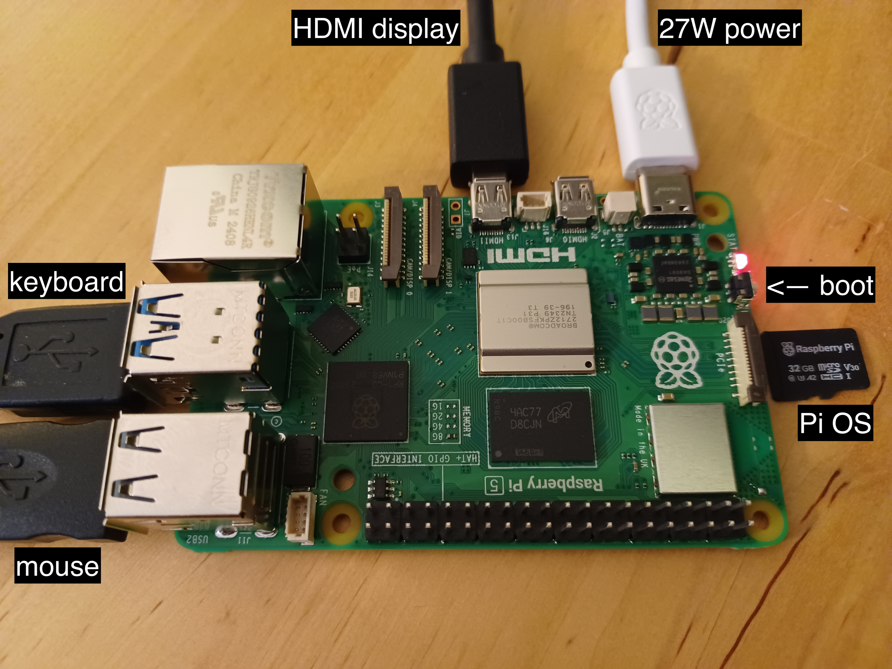
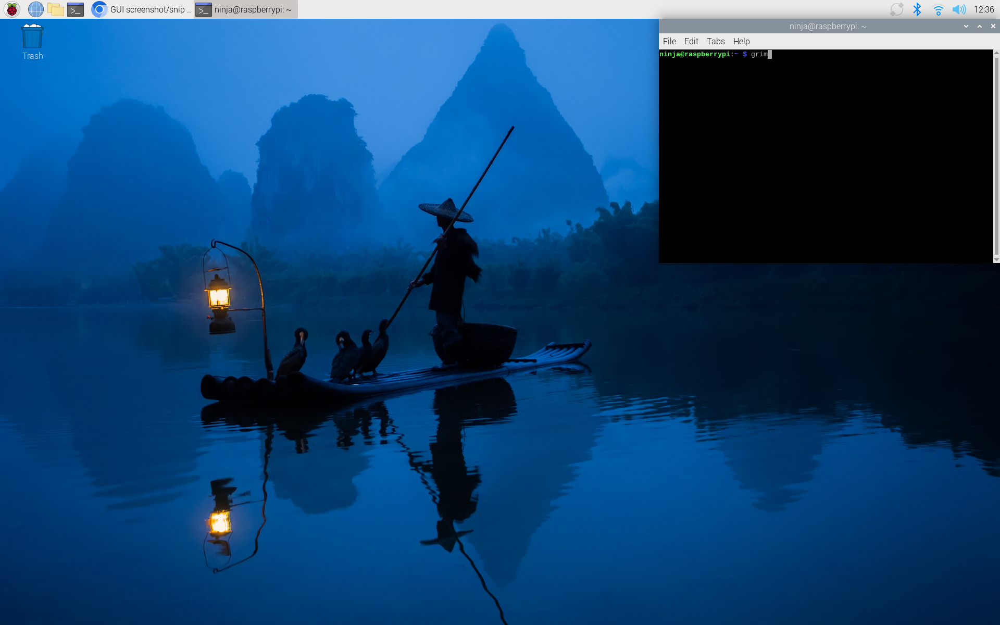
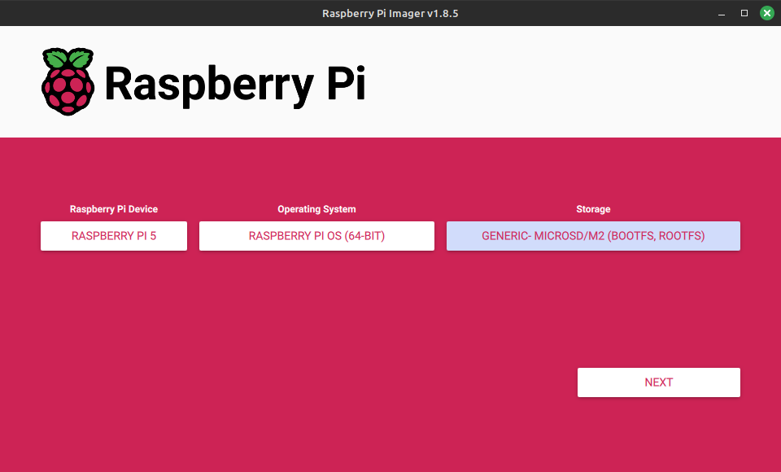
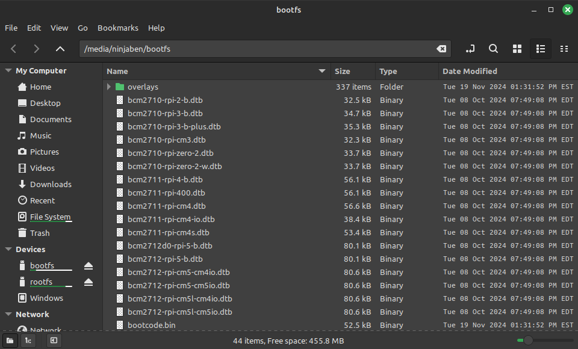
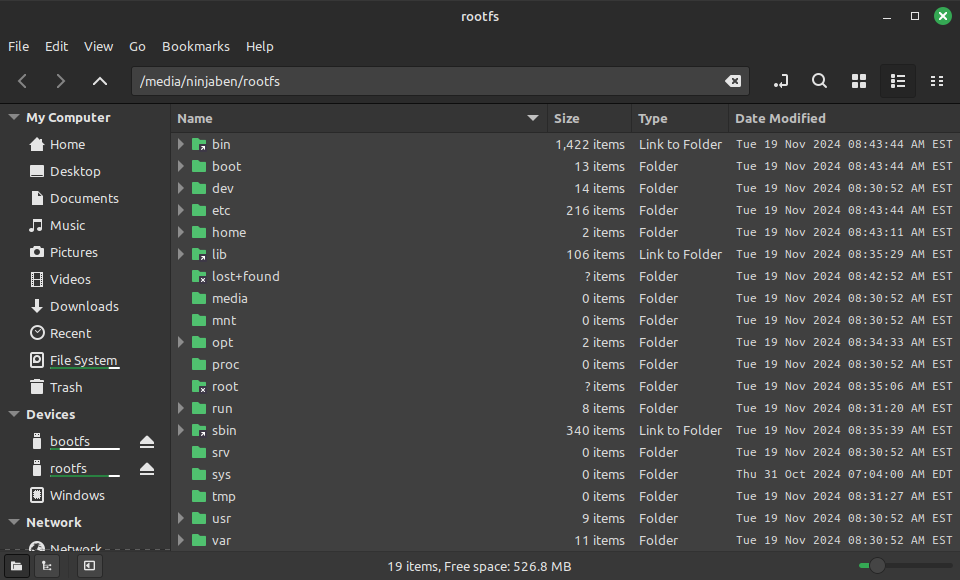
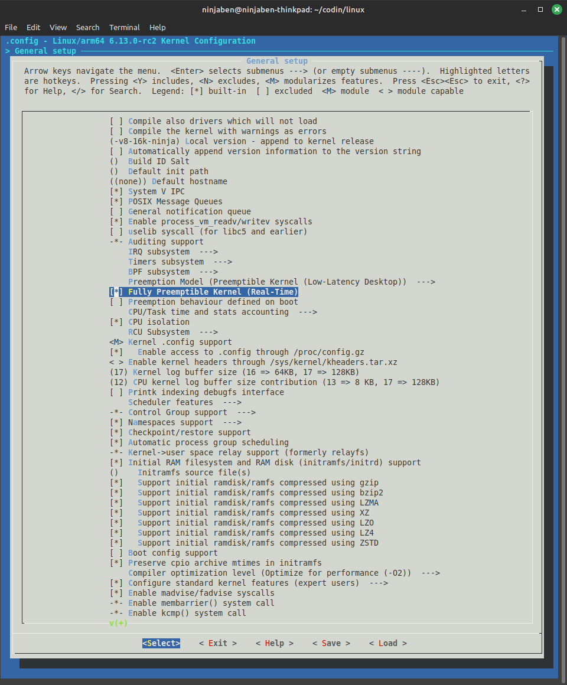

# Raspberry Pi Setup

We often run `dserv` and related programs on a [Raspberry Pi](https://www.raspberrypi.com/).

This guide can help you get started with the Pi itself.
It also walks through cross-compiling and installing a real-time Linux kernel for the Pi -- as preferred for running experiments.

The whole process from unboxing to running a fresh kernel can take just tens of minutes.

## Hardware

The Pi is mostly self-contained but a few accessories are helpful.
Here's a potential shopping list from eg [PiShop.us](https://www.pishop.us/):

 - [Raspberry Pi 5](https://www.pishop.us/product/raspberry-pi-5-8gb/)
 - [27W USB-C Power Supply](https://www.pishop.us/product/raspberry-pi-27w-usb-c-power-supply-white-us/)
 - [Micro-HDMI to HDMI cable](https://www.pishop.us/product/micro-hdmi-to-hdmi-cable-for-pi-4-3ft-black/)
 - [microSD Card with Raspberry Pi OS 64-bit](https://www.pishop.us/product/class-10-microsd-card-with-raspberry-pi-os-bookworm-32gb/) (handy for getting started right out of the box)
 - [blank microSD Card](https://www.pishop.us/product/microsd-card-64-gb-class-10-blank/) (for installing customized Pi OS and real-time kernel)

You might already have peripherals like:

 - a USB keyboard
 - a USB mouse
 - an HDMI display

When we cross-compile the kernel we'll use a build machine that has more processing power than the Pi itself.
The build machine must have a microSD card reader/writer -- either integrated or one like this:

 - [Manhattan USB-A to Multi-Card Reader/Writer](https://manhattanproducts.us/products/manhattan-en-multi-card-readerwriter-101998?srsltid=AfmBOoosNlBCLPVUG6N0oD4Dht1tY1Jb34dBzxcXmzoWd507yjbENLPm)

## New to Pi

If you're new to the Raspberry Pi it might be helpful to set it up and boot it, straight out of the box.

The official [Getting started](https://www.raspberrypi.com/documentation/computers/getting-started.html) docs are great and applicable to multiple situations.
Here's a specific example of of the setup used in this guide:



Insert the microSD card that has Pi OS into the reader slot which is just under the board.
Press the boot button next to the red LED.
Boot info and a first-time setup screen should appear on the HDMI display.

After following the setup flow you should end up at a desktop that looks like this:



The Pi can boot from any SD card we put in the main slot.
Below, we'll swap out the card and boot up customized versions of the OS.

## Create a bootable SD card

Next you can try customizing Pi OS and making a bootable SD card.
This allows you to configure the Pi ahead of time: rather than stepping through interactive first-time setup, you can pre-configure things like the user account, wifi credentials, ssh setup, etc.

We'll reuse this same bootable SD card later on when we install a real-time build of the kernel.

For now we'll work with a generic version of Pi OS and the default kernel via the official [Raspberry Pi Imager](https://www.raspberrypi.com/software/).

Install the Pi Imager on your build machine.
Insert a blank microSD card (or one you're willing to erase) and launch the imager app.



For this guide we'll choose:

 - RASPBERRY PI 5
 - RASPBERRY PI OS (64-BIT)
 - your own microSD card

Click "NEXT" and follow prompts.
This is where you can set up your own user account, wifi, ssh, etc., if you want.

The imager will take a few minutes to partition and format the SD card, then write out and verify Pi OS.
When complete, the SD card will have separate partitions for `bootfs` and `rootfs`.
If you view these in a regular file browser they should look like this:

`bootfs`:



`rootfs`:



## Try it

Eject the SD card from your build machine and insert it into the Pi (shut down the Pi first).
Press the PI's boot button, and the Pi desktop should come up with your customized Pi OS.

If you configured, say, wifi, then the Pi should connect to your network automatically at startup.

# Real-Time Linux Kernel

With the Pi up and running and a bootable SD card in hand, you can now cross-compile and install a real-time Linux kernel.

The official Pi docs for [The Linux kernel](https://www.raspberrypi.com/documentation/computers/linux_kernel.html) are great, and applicable to multiple situations.
This guide will follow one path through the docs, focused on cross-compiling the kernel for real-time capabilities.

## Configure build machine

This guide assumes we're building the kernel on a separate build machine, rather than on the Pi itself.
This should be much faster.
Futher, we'll assume the build machine is running a Debian-based distribution like Ubuntu or Mint.
Other distributions should also work but installing the required packages might look different.

Make sure your build machine has the following dependencies installed:

```
# common tools
sudo apt install bc bison flex libssl-dev make libc6-dev libncurses5-dev

# for cross-compiling (eg x86_64 build machine to arm64 Pi)
sudo apt install crossbuild-essential-arm64

# for menu-based kernel configuration
sudo apt install libncurses5-dev
```

## Get the source

The Raspberry Pi organization hosts versions of the Linux kernel that are configured for the Pi.
We'll clone their source from [GitHub](https://github.com/raspberrypi/linux).

We need kernel version `6.12` or later.
This is the first version with real-time capability baked in (no need to apply patches).

Since the default branch may be older than `6.12`, we specify the one we want by name.
To clone, say, `6.13` on your build machine:

```
git clone --depth=1 --branch rpi-6.13.y https://github.com/raspberrypi/linux
```

## Configure the kernel

Start by creating initial Kernel configuration, in this case for the 64-bit Raspberry Pi 5.

```
cd linux
KERNEL=kernel_2712
make ARCH=arm64 CROSS_COMPILE=aarch64-linux-gnu- bcm2712_defconfig
```

Next use [menuconfig](https://en.wikipedia.org/wiki/Menuconfig) to customize the configuration.

```
make ARCH=arm64 CROSS_COMPILE=aarch64-linux-gnu- menuconfig
```

This should bring up the menuconfig graphical interface in your terminal.



Within menuconfig use arrows to navigate to:

 - `General settings` ->
   - `Local version` ->
     - enter a suffix to identify this as your own custom build, perhaps `-v8-16k-ninja`
   - `Configure standard kernel features (expert users)`
     - include this by pressing "Y" (it might be included already)
   - `Fully Preemptible Kernel (Real-Time)`
     - include this by pressing "Y"

Exit menuconfig by pressing "Esc" several times.
When prompted choose "Yes" to save config.

All of this will produce a kernel config file named `.config`.
You can verify that your settings were saved by grepping through this file:

```
$ grep "ninja" .config 
CONFIG_LOCALVERSION="-v8-16k-ninja"         <-- your own kernel build!

$ grep "PREEMPT" .config 
CONFIG_PREEMPT_BUILD=y
# CONFIG_PREEMPT_NONE is not set
# CONFIG_PREEMPT_VOLUNTARY is not set
CONFIG_PREEMPT=y
CONFIG_PREEMPT_RT=y                         <-- real-time!
CONFIG_PREEMPT_COUNT=y
CONFIG_PREEMPTION=y
# CONFIG_PREEMPT_DYNAMIC is not set
CONFIG_PREEMPT_RCU=y
CONFIG_HAVE_PREEMPT_DYNAMIC=y
CONFIG_HAVE_PREEMPT_DYNAMIC_KEY=y
CONFIG_PREEMPT_NOTIFIERS=y
# CONFIG_DEBUG_PREEMPT is not set
# CONFIG_PREEMPT_TRACER is not set
# CONFIG_PREEMPTIRQ_DELAY_TEST is not set
```

## Build the kernel

Now you can build the kernel.
It will go faster if you use multiple parallel jobs across CPU cores.

Check how many CPU cores your build machine has with `nproc`:

```
$ nproc
16
```

The Pi docs suggest building with jobs 1.5x the number of cores.
In this example 16 cores -> 24 jobs, AKA `-j24`.

From the same `linux/` subdir as above, cross-compile the kernel for the Pi (arm64).

```
make -j24 ARCH=arm64 CROSS_COMPILE=aarch64-linux-gnu- Image modules dtbs
```

This might take several minutes to complete.

## Install the kernel on a bootable SD card

Now you can install the kernel to the bootable SD card we created above.

Insert the SD card into your build machine.
Verity that the `bootfs` and `rootfs` partitions are present and mounted.
Some distributions automatically mount these on insert, in which which case `lsblk` would show something like:

```
$ lsblk

...

sde           8:64   1  59.5G  0 disk 
├─sde1        8:65   1   512M  0 part /media/ninjaben/bootfs
└─sde2        8:66   1    59G  0 part /media/ninjaben/rootfs
```

We'll use these path names `/media/ninjaben/bootfs` and `/media/ninjaben/rootfs` in the install commands below.
You should change them to match your own file system.
If your system doesn't automatically mount these partitions, you can follow instructions from the pi docs [here](https://www.raspberrypi.com/documentation/computers/linux_kernel.html#find-your-boot-media).

Install kernel modules to `rootfs`:

```
sudo env PATH=$PATH make -j24 ARCH=arm64 CROSS_COMPILE=aarch64-linux-gnu- INSTALL_MOD_PATH=/media/ninjaben/rootfs modules_install
```

Install the kernel and "Device Tree blobs" to `bootfs`:

```
sudo cp /media/ninjaben/bootfs/$KERNEL.img /media/ninjaben/bootfs/$KERNEL-backup.img
sudo cp arch/arm64/boot/Image /media/ninjaben/bootfs/$KERNEL.img
sudo cp arch/arm64/boot/dts/broadcom/*.dtb /media/ninjaben/bootfs
sudo cp arch/arm64/boot/dts/overlays/*.dtb* /media/ninjaben/bootfs/overlays/
sudo cp arch/arm64/boot/dts/overlays/README /media/ninjaben/bootfs/overlays/
```

Note: these commands use env var `KERNEL=kernel_2712`, which we set above during configuration.

## Try it

Eject the SD card from the build machine and insert it into the Pi (shut down the Pi first).
Press the boot button, and the Pi should come back up with your customized Pi OS.

This should retain any user, wifi, ssh, or other configuration you set up before.

In addition, now it should be using your custom-built real-time kernel.

You can check for the expected version, build name and real-time capabilities:

```
$ uname -a
Linux raspberrypi 6.13.0-rc2-v8-16k-ninja+ #1 SMP PREEMPT_RT Tue Dec 10 10:10:34 EST 2024 aarch64 GNU/Linux
```

or

```
$ cat /proc/version 
Linux version 6.13.0-rc2-v8-16k-ninja+ (ninjaben@ninjaben-thinkpad) (aarch64-linux-gnu-gcc (Ubuntu 11.4.0-1ubuntu1~22.04) 11.4.0, GNU ld (GNU Binutils for Ubuntu) 2.38) #1 SMP PREEMPT_RT Tue Dec 10 10:10:34 EST 2024
```

You should see the kernel version we cloned (`6.13`), your own version suffix (`-v8-16k-ninja`), and `PREEMPT_RT` to indicate real-time capabilities.
